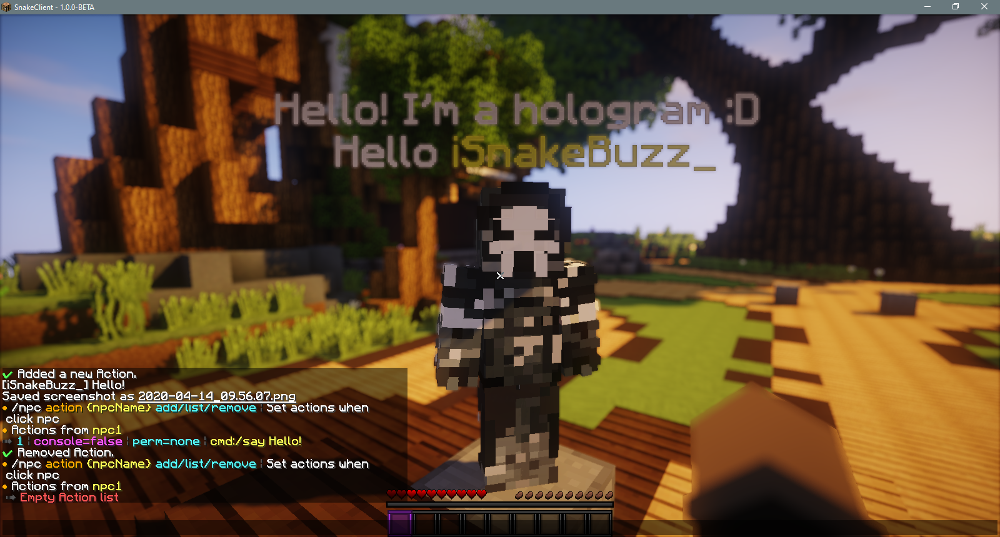

# Actions

## Getting started with Actions

The first thing you need to know is that there are multiple actions. Such as.

* Send player to server
* Execute command
* Send private message to player

**I hear recommendations..**

### Add new actions

For example, add the commnad "/say hello" to the npc

```text
/npc action (NPC NAME) add (TRUE/FALSE - CONSOLE) (PERMISSIONS OR NONE) (ACTION)
```

On \(ACTION\) you can put these options. Without `()` please.

* **cmd**:/say Hello
* **server**:Survival
* **msg**:&aHello %player%
* **wait**:1000 \(It is in [MILISECONDS](https://www.google.com/search?q=1000+milliseconds+to+seconds&oq=1000+milliseconds+to+seconds&aqs=chrome..69i57.447j0j9&sourceid=chrome&ie=UTF-8)\)


### Getting actions setted

```text
/npc action (NPC NAME) list
```


### Removing Action

To remove the action added before, use the command below.

```text
/npc action (NPC NAME) remove (ACTION ID)
```




